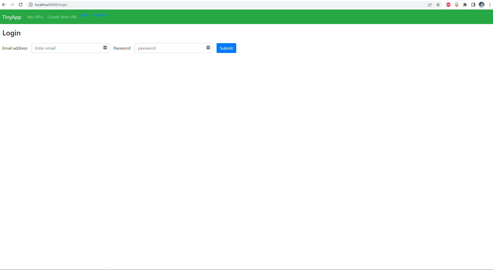
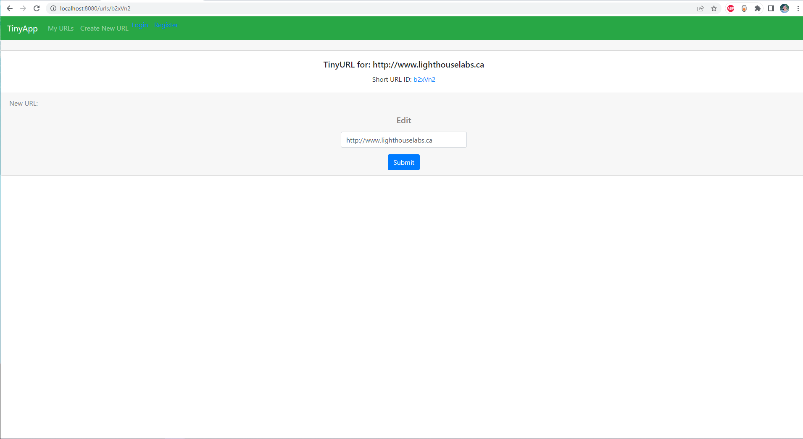

# 🔗 Welcome to TinyApp: Unlocking the Power of Short Links! 🔗

Have you ever wished you could shrink those lengthy, cumbersome URLs into something more manageable? Look no further! TinyApp is here to revolutionize the way you share and navigate the web.

This is a full stack web application built with Node and Express that aims to simplify the process of sharing lengthy URLs by creating short URLs(à la bit.ly) that redirect to the original address. 

## Features

- URL Shortening: Generate short URLs from long ones.
- URL Redirection: Redirect shortened URLs to their original addresses.
- User Authentication: Allow users to sign up, log in, and manage only their shortened URLs.
- You made a typo in your URL when creating it? You can edit or delete it!

## Technologies Used

- Frontend: HTML, CSS, JavaScript
- Backend: Node.js, Express.js

## Final Product

## Dependencies

- Node.js
- Express
- EJS
- bcryptjs
- cookie-session
- mocha and chai (for tests)

## Getting Started

- Node.js and npm (Node Package Manager) must be installed on your system.
- Clone this repository to your local machine using `git clone` command.
- Install all dependencies (using the `npm install` command).
- Run the development web server using the `node express_server.js` command.
- The TinyApp should now be running locally at http://localhost:8080/.

## Contributing

Contributions are welcome! If you find any issues or would like to suggest enhancements, please submit an issue or create a pull request on the GitHub repository. Feel free to contact me at *haman42626@gmail.com*.

## Acknowledgements

- The TinyApp project was inspired by the original [TinyURL service](https://tinyurl.com/app)
- Special thanks to the open-source community for providing the tools and libraries used in this project